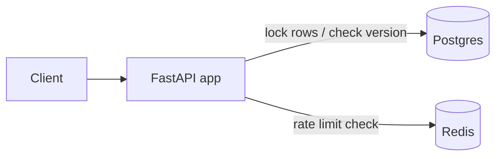
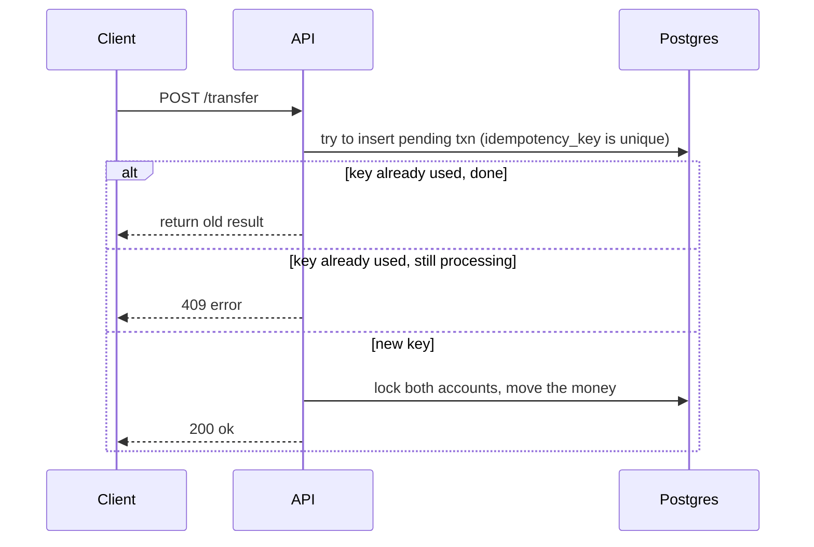

# SplitLedger

[](https://github.com/richa2835/Splitledger/actions/workflows/ci.yml)

A small backend for splitting expenses with friends and sending money between wallets. Made this because I wanted to actually understand how apps like Splitwise/payment apps handle the tricky stuff - what happens when two requests hit the same account at the same time, or when your phone retries a request because the network was slow and it thinks it failed.

Most of the projects I'd built before this only handled the "everything goes right" case. This one is specifically trying to not break when things go wrong at the same time.

## Stack

- FastAPI (Python) for the API
- PostgreSQL for the database
- Redis for rate limiting
- Docker so it's easy to run
- k6 for load testing

## The main problem I was solving

If 100 people (or the same person spamming the button) try to send money from one account at the exact same time, a naive implementation will mess up the balance. Two requests both read "balance = 1000" before either one writes back, so one of the writes just gets lost.

I tested this myself - fired 100 concurrent transfer requests from one account and checked the final balance:

| Approach | Requests | Time | Balance correct? |
|---|---|---|---|
| No protection (control) | 100 | 1.87s | No - off by 94 units |
| Row locking (`SELECT FOR UPDATE`) | 100 | 1.67s | Yes |
| Version-based locking (optimistic) | 100 | 3.28s | Yes |

The "no protection" row is there on purpose, to actually show the bug happens and not just claim it does.

**Two ways I fixed it:**

1. **Pessimistic locking** - lock both accounts before touching them (`SELECT ... FOR UPDATE`). Straightforward, always correct, but requests have to wait their turn if they're hitting the same account.
2. **Optimistic locking** - each account has a version number. Read the balance + version, try to update but only if the version hasn't changed since you read it. If someone else updated it first, retry.

Both need one more trick to avoid deadlocks: when locking two accounts, always lock the one with the smaller id first, no matter which one is sender/receiver. Otherwise two transfers going in opposite directions can lock each other out forever.

You can pick which one to use with `?strategy=pessimistic` or `?strategy=optimistic` on the transfer endpoint.

Run the test yourself:
```bash
docker-compose exec api pytest tests/test_concurrency.py -v -s
```

## Idempotency (not double-charging on retry)

If your phone sends a transfer request and the response times out, it doesn't know if the transfer actually happened - so it might retry. If that retry gets processed again, you just got double-charged.

Fix: every transfer needs a unique `idempotency_key` from the client. Before processing, I check if that key was already used:
- already used and done → just return the same result again, don't redo it
- already used but still processing → return a 409 error
- new key → process normally

The key thing is this check is backed by an actual unique constraint in the database, not just an if-check in the code - because two identical requests could both pass an "if-check" at the same time before either finishes writing.

## Expense splitting

Groups can add expenses and split them equally or with custom amounts. When you check group balances, it doesn't just dump a list of "who paid what" - it simplifies it down to the minimum number of payments needed. If A owes B ₹200 and B owes A ₹150, it just shows "A owes B ₹50" instead of both.

## Rate limiting

Basic token bucket limiter using Redis so it works even if there were multiple servers. Returns `X-RateLimit-Remaining` in the headers.

## API endpoints

**Wallet**
- `POST /users`
- `POST /accounts/{id}/deposit`
- `POST /transfer` (body: from_account, to_account, amount, idempotency_key)
- `GET /accounts/{id}/balance`
- `GET /accounts/{id}/transactions`

**Groups**
- `POST /groups`
- `POST /groups/{id}/expenses`
- `GET /groups/{id}/balances`
- `POST /groups/{id}/settle`

Full docs at `/docs` once it's running.

## Architecture



How a transfer request gets handled:



## Data model

Balances aren't stored as just a single number you increment/decrement. Every transfer writes two rows to `ledger_entries` (a debit and a credit) that have to sum to zero. `accounts.balance` is really just a cached number - the ledger is the actual source of truth, so you could recompute any balance from scratch by replaying the ledger. This is basically how real accounting systems work.

```
users            (id, name, email, created_at)
accounts         (id, user_id, balance, version, created_at)
transactions     (id, from_account, to_account, amount, status, idempotency_key, created_at)
ledger_entries   (id, transaction_id, account_id, entry_type, amount, created_at)
groups           (id, name, created_at)
group_members    (group_id, user_id)
expenses         (id, group_id, paid_by, amount, description, created_at)
expense_splits   (id, expense_id, user_id, share_amount, settled)
settlements      (id, group_id, from_user, to_user, amount, created_at)
```

## Running it

Need Docker Desktop installed and running.

```bash
git clone https://github.com/richa2835/Splitledger.git
cd Splitledger
docker-compose up --build
```

API runs at `localhost:8000`, docs at `localhost:8000/docs`.

## Tests

```bash
docker-compose exec api pytest tests/ -v -s
```

7 tests, covering the concurrency stuff, idempotency, and the debt splitting logic.

## CI

There's a GitHub Actions workflow that runs the whole test suite (with real Postgres + Redis, not mocked) on every push. Badge at the top of this README reflects whether it's passing.

## Load testing

```bash
k6 run load-test.js
```
(needs k6 installed, and the API running). Ramps up virtual users hitting both read and write endpoints, prints latency numbers at the end.

## Project structure

```
splitledger/
├── .github/workflows/ci.yml
├── app/
│   ├── main.py
│   ├── models.py
│   ├── schemas.py
│   ├── db.py
│   ├── routes/
│   │   ├── wallet.py
│   │   └── groups.py
│   └── services/
│       ├── transfer_service.py     # locking logic
│       ├── settlement_service.py   # debt simplification
│       └── rate_limit.py
├── tests/
├── load-test.js
├── docker-compose.yml
├── Dockerfile
└── requirements.txt
```

## Notes to self

Initially I had a version with no locking at all and didn't even realize the balance could get corrupted until I actually wrote a test that fired a bunch of requests at once. Fixed it two different ways so I could actually compare them instead of just picking one and assuming it's right. Pessimistic locking ended up faster in my test, but that's because all 100 requests were hammering the same account - if it was spread across different accounts I'd expect optimistic to win instead since it's not waiting around for a lock.
