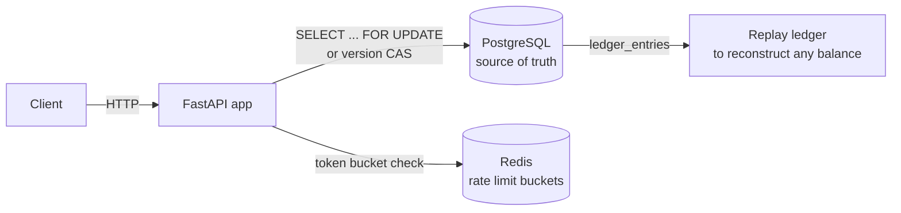
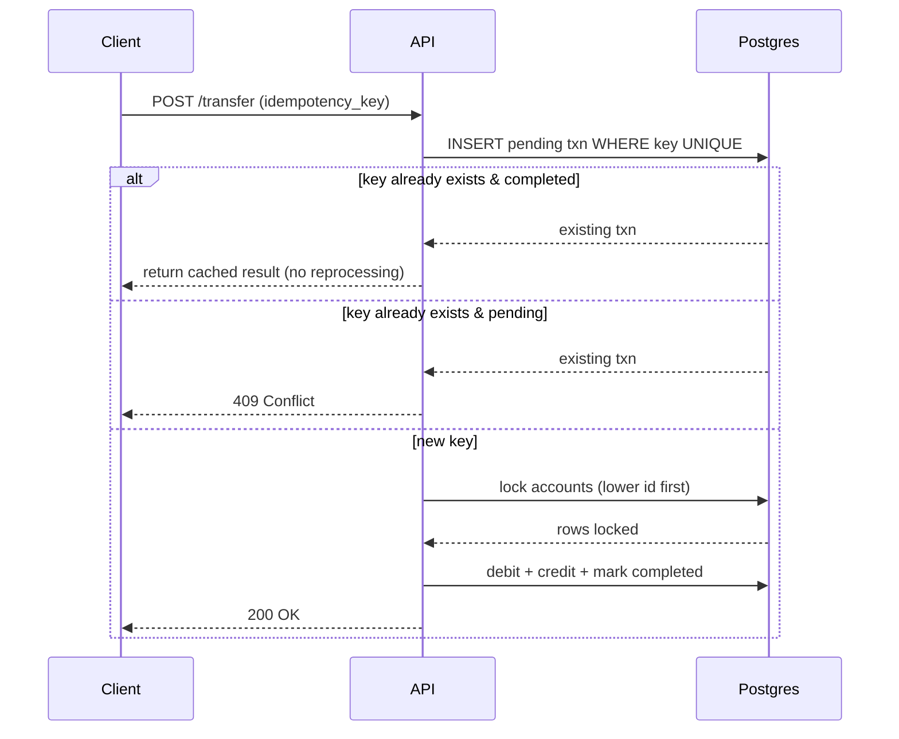

# SplitLedger

[](https://github.com/richa2835/Splitledger/actions/workflows/ci.yml)
[](LICENSE)

A backend service for wallet transfers and group expense splitting, built to stay correct under concurrent requests and duplicate/retried calls — the same class of problem real payment systems solve.

## Table of contents

- [Why this project exists](#why-this-project-exists)
- [Tech stack](#tech-stack)
- [Architecture](#architecture)
- [Data model](#data-model)
- [Concurrency handling](#concurrency-handling--two-implementations-compared)
- [Idempotency](#idempotency)
- [Rate limiting](#rate-limiting)
- [Debt simplification](#group-expense-splitting--debt-simplification)
- [API endpoints](#api-endpoints)
- [Running locally](#running-locally)
- [Running the tests](#running-the-tests)
- [CI/CD](#cicd)
- [Load testing](#load-testing)
- [Project structure](#project-structure)

## Why this project exists

Most student projects handle the "happy path": one user, one request, no failures. Payment systems fail differently — two requests hit the same account at once, a client retries a timed-out request, a network blip causes a double-submit. This project is built specifically to survive those cases correctly, and to prove it with tests and real numbers.

## Tech stack

| Layer | Choice | Why |
|---|---|---|
| API | FastAPI (Python) | async support, auto-generated OpenAPI docs |
| Database | PostgreSQL | ACID transactions, row-level locking |
| Cache/Locks | Redis | rate limiting |
| Containerization | Docker + docker-compose | one-command local setup |
| Load testing | k6 | scriptable, gives p50/p95/p99 out of the box |

## Architecture



### How a transfer request actually flows



## Data model

`accounts.balance` is a **cache, not the source of truth**. The truth is `ledger_entries` — every transfer writes a debit row and a credit row that must sum to zero. This means the full transaction history can be replayed to reconstruct any balance, exactly how real accounting/audit systems work.

```
users            (id, name, email, created_at)
accounts         (id, user_id, balance, version, created_at)
transactions     (id, from_account, to_account, amount, status, idempotency_key, created_at)
ledger_entries   (id, transaction_id, account_id, entry_type[debit|credit], amount, created_at)
groups           (id, name, created_at)
group_members    (group_id, user_id)
expenses         (id, group_id, paid_by, amount, description, created_at)
expense_splits   (id, expense_id, user_id, share_amount, settled)
settlements      (id, group_id, from_user, to_user, amount, created_at)
```

## Concurrency handling — two implementations compared

- **Pessimistic locking**: `SELECT ... FOR UPDATE` on both accounts before applying the transfer. Simple, always correct, throughput drops under heavy contention on the same row because requests queue up.
- **Optimistic locking**: each account has a `version` column. Read balance + version, attempt `UPDATE ... WHERE version = read_version`, retry with exponential backoff + jitter if 0 rows were affected (someone else won the race).
- **Lock ordering rule** (both approaches): always touch the account with the lower `id` first, regardless of sender/receiver. This is what prevents deadlocks when two transfers happen in opposite directions at the same time.

Pick the strategy per-request with `?strategy=pessimistic` or `?strategy=optimistic` on `POST /transfer` (defaults to pessimistic).

### Real test results (100 concurrent transfers, same source account)

Measured directly by `tests/test_concurrency.py` on this machine:

| Strategy | Requests | Total time | Throughput | Final balance correct? |
|---|---|---|---|---|
| Pessimistic (`FOR UPDATE`) | 100 | 1.67s | 60.0 req/s | correct — 9900.00 (expected 9900.00) |
| Optimistic (version + retry) | 100 | 3.28s | 30.5 req/s | correct — 9900.00 (expected 9900.00) |
| No locking (control) | 100 | 1.87s | 53.5 req/s | wrong — 9994.00 (expected 9900.00, lost 94 updates) |

That last row is the point: with no protection, concurrent requests reading-then-writing the same row silently lose updates. Both real strategies fix it. Pessimistic came out faster here because all 100 requests were hitting the same single account — that's the case row locking handles well. With low contention (many different account pairs instead), optimistic tends to do better since it isn't waiting on a lock. Worth trying both ways yourself, numbers shift depending on the contention pattern.

**Run this yourself** (numbers will vary slightly run to run):
```bash
docker-compose exec api pytest tests/test_concurrency.py -v -s
```

## Idempotency

Every transfer request carries a client-generated `idempotency_key`. The key has a **database-level unique constraint** (not just an application check) — this matters because two identical retries racing microseconds apart could both pass an app-level "does this exist" check before either commits; the DB constraint is what actually guarantees only one wins.

- Key exists + `completed` → return the original result, no reprocessing
- Key exists + `pending` → `409 Conflict`
- Key doesn't exist → process normally, claim the key first

Verified in `tests/test_idempotency.py`: firing the exact same request twice only changes the balance once.

## Rate limiting

Token bucket algorithm backed by Redis (via an atomic Lua script, so concurrent requests can't both read the same token count and both get let through). Limit and remaining count are returned in `X-RateLimit-Limit` / `X-RateLimit-Remaining` headers. Configurable via `RATE_LIMIT_CAPACITY` / `RATE_LIMIT_REFILL_RATE` env vars (defaults: burst of 100, refills 30/sec).

## Group expense splitting — debt simplification

`GET /groups/{id}/balances` doesn't just list raw "A paid for B" records — it nets them out using a greedy graph algorithm: repeatedly match the person owed the most with the person who owes the most, minimizing the total number of settling payments. Example: if A owes B ₹200 and B owes A ₹150, the simplified view shows a single payment — A owes B ₹50 — instead of two.

## API endpoints

**Wallet**
- `POST /users` — create user + zero-balance account
- `POST /accounts/{id}/deposit` — body: `{amount}`
- `POST /transfer?strategy=pessimistic|optimistic` — body: `{from_account, to_account, amount, idempotency_key}`
- `GET /accounts/{id}/balance`
- `GET /accounts/{id}/transactions?page=&limit=`

**Groups**
- `POST /groups` — body: `{name, member_ids[]}`
- `POST /groups/{id}/expenses` — body: `{paid_by, amount, description, split_type[equal|custom], splits[]}`
- `GET /groups/{id}/balances`
- `POST /groups/{id}/settle` — body: `{from_user, to_user, amount}`

Full interactive docs (auto-generated): `http://localhost:8000/docs`

### Sample request/response

```
POST /transfer
{
  "from_account": 12,
  "to_account": 47,
  "amount": 500.00,
  "idempotency_key": "c8f1e2a4-9b3d-4e21-8f60-2a1b7d9e0c33"
}
```
```json
{
  "transaction_id": 9981,
  "status": "completed",
  "from_account_balance": 1250.00,
  "to_account_balance": 2130.00,
  "ledger_entries": [
    {"account_id": 12, "type": "debit", "amount": 500.00},
    {"account_id": 47, "type": "credit", "amount": 500.00}
  ]
}
```

## Running locally

**Prerequisites:** [Docker Desktop](https://www.docker.com/products/docker-desktop/) installed and running.

```bash
git clone <your-repo-url>
cd splitledger
docker-compose up --build
```
- API: `http://localhost:8000`
- Interactive docs: `http://localhost:8000/docs`

(If your Docker version uses the newer plugin syntax, use `docker compose up --build` — space instead of hyphen. Both do the same thing.)

## Running the tests

```bash
docker-compose exec api pytest tests/ -v -s
```

## CI/CD

Every push and pull request to `main` triggers [`.github/workflows/ci.yml`](.github/workflows/ci.yml):
1. Spins up Postgres and Redis containers (real ones, not mocks, since the point of the concurrency tests is checking against a real database's actual locking behavior)
2. Installs dependencies
3. Runs the full test suite, including the 100-concurrent-transfer test
4. Boots the API and hits `/health` as a smoke test

If any of these steps fail, the badge at the top of this README goes red.

## Load testing

Install [k6](https://k6.io/docs/get-started/installation/), then with the API running:
```bash
k6 run load-test.js
```
Ramps virtual users from 20 → 50 across reads (`GET /balance`) and writes (`POST /transfer`), and prints requests/sec, p50/p95/p99 latency, and error rate at the end. Paste those numbers here once you've run it on your machine:

```
Requests/sec sustained: ___
p50 latency: ___
p95 latency: ___
p99 latency: ___
Error rate at peak load: ___
```

## Project structure

```
splitledger/
├── .github/
│   └── workflows/
│       └── ci.yml                   # runs tests on every push
├── app/
│   ├── main.py
│   ├── models.py
│   ├── schemas.py
│   ├── db.py
│   ├── routes/
│   │   ├── wallet.py
│   │   └── groups.py
│   └── services/
│       ├── transfer_service.py      # locking logic lives here
│       ├── settlement_service.py    # debt simplification
│       └── rate_limit.py
├── tests/
│   ├── test_concurrency.py          # the 100-concurrent-request test
│   ├── test_idempotency.py
│   └── test_settlement.py
├── load-test.js
├── docker-compose.yml
├── Dockerfile
├── requirements.txt
├── LICENSE
└── README.md
```

## Lessons learned

"I built a wallet system and initially had a race condition where concurrent transfers corrupted account balances. I diagnosed it with a concurrency test firing 100 simultaneous requests, then fixed it two ways — pessimistic row locking and optimistic versioning — and measured the throughput tradeoff between them: pessimistic won under heavy single-row contention, which is exactly the scenario it's designed for. I also added idempotency keys after realizing a naive retry could double-charge a user, backed by a database unique constraint so it holds up even under a race on the key itself."
